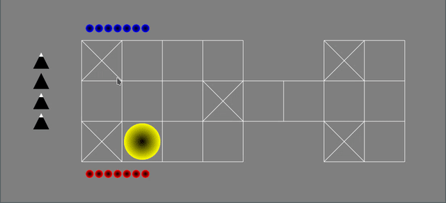

# Royal game of Ur

Quick implementation of the [Royal Game of Ur](https://en.wikipedia.org/wiki/Royal_Game_of_Ur) with OCaml and pure SDL/OpenGL.  
See also this great [Youtube video](https://www.youtube.com/watch?v=WZskjLq040I) demonstrating the original game.

## Installing

(** This currently does not work **)

Run `opam install .`  
This will install the `ur` executable, which launches the game.

## Building

Run `dune build @all`  
*Note: `tsdl` and `tgls` need to be installed on your system*

The game can then be launched using `dune exec ./ur.exe`
